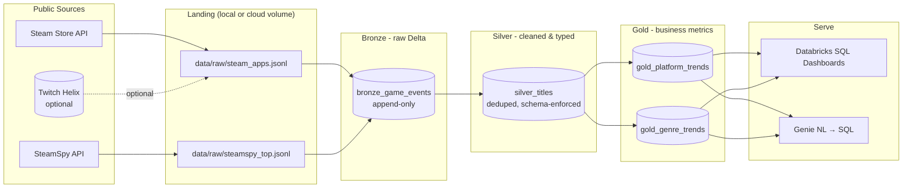

# Architecture

The Game Trend Lakehouse is a classic medallion pipeline: raw API responses land as immutable JSONL, are appended to a Bronze Delta table, cleaned and deduped into Silver, and aggregated into Gold tables that back dashboards and a Genie natural-language interface.

## Diagram

## Layer contracts

### Bronze — `bronze_game_events`

- **Purpose**: append-only landing of raw JSON payloads with provenance metadata.
- **Write pattern**: `df.write.format("delta").mode("append")`.
- **Schema (minimum)**:
  - `source` STRING — `"steam_store"` | `"steamspy"` | `"twitch_helix"`
  - `ingested_at` TIMESTAMP
  - `payload` STRING (raw JSON; intentionally not exploded yet)
  - `batch_id` STRING (UUID per extraction run)
- **Why raw**: lets us re-derive Silver from history when upstream APIs evolve.

### Silver — `silver_titles`

- **Purpose**: one row per Steam `appid`, with typed columns and derived fields.
- **Write pattern**: `MERGE INTO ... ON appid` (idempotent upsert).
- **Derived fields**: `release_year`, `is_free`, `supports_linux`, `supports_mac`, `supports_windows`, `primary_genre`, `genre_list`.
- **Quality rules**: drop rows missing `appid` or `name`; cast `price_cents` to INT; coalesce empty genre lists to `["unknown"]`.

### Gold — `gold_platform_trends`

Aggregate of `silver_titles` by `release_year` × platform:

| column          | type   |
| --------------- | ------ |
| release_year    | INT    |
| platform        | STRING |
| title_count     | BIGINT |
| free_pct        | DOUBLE |
| avg_price_cents | DOUBLE |

### Gold — `gold_genre_trends`

Aggregate of `silver_titles` by `release_year` × `primary_genre`:

| column        | type   |
| ------------- | ------ |
| release_year  | INT    |
| primary_genre | STRING |
| title_count   | BIGINT |
| release_share | DOUBLE |
| avg_price_cents | DOUBLE |

## Operational notes

- **Idempotency**: Bronze is append-only; Silver uses MERGE on `appid`; Gold is `CREATE OR REPLACE TABLE` from Silver — re-running the full pipeline is safe.
- **Partitioning**: at meaningful scale, partition Silver and Gold by `release_year` (low cardinality, naturally filtered in dashboards).
- **Catalog naming**: defaults to `main.game_trends.<table>`; override via notebook widgets.
- **Lakeflow / Asset Bundle**: `resources/databricks_asset_bundle.yml` shows the three notebooks chained as tasks; promote to a Lakeflow declarative pipeline by converting the notebooks to `@dlt.table` definitions.
