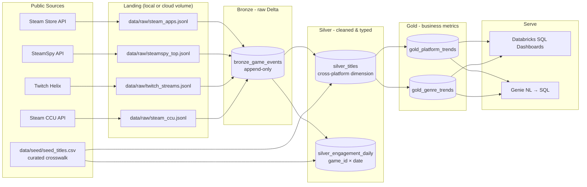

# Architecture

The Game Trend Lakehouse is a classic medallion pipeline: raw API responses land as immutable JSONL, are appended to a Bronze Delta table, cleaned and deduped into Silver, and aggregated into Gold tables that back dashboards and a Genie natural-language interface.

## Diagram

## Layer contracts

### Bronze — `bronze_game_events`

- **Purpose**: append-only landing of raw JSON payloads with provenance metadata.
- **Write pattern**: `df.write.format("delta").mode("append")`.
- **Schema (minimum)**:
  - `source` STRING — `"steam_store"` | `"steamspy"` | `"twitch_helix"` | `"steam_ccu"` | …
  - `entity_key` STRING — source-native ID (appid, Twitch category, …); nullable for legacy rows
  - `extract_date` DATE — the date the payload *describes* (≠ `ingested_at` for backfills)
  - `ingested_at` TIMESTAMP
  - `payload` STRING (raw JSON; intentionally not exploded yet)
  - `batch_id` STRING (UUID per extraction run)
- **Why raw**: lets us re-derive Silver from history when upstream APIs evolve.

### Silver — `silver_titles`

- **Purpose**: the canonical **cross-platform title dimension** — one row per
  `game_id`, covering both Steam titles and off-Steam PC titles (Fortnite,
  League of Legends, …). See [`multi_platform_plan.md`](multi_platform_plan.md).
- **Key**: `game_id`, a stable slug from the seed crosswalk
  `data/seed/seed_titles.csv`; Steam titles outside the seed get a slugified
  name. `steam_appid` is **nullable** — NULL marks an off-Steam title, and the
  derived `on_steam` flag is the headline cohort split in Gold.
- **Crosswalk columns**: `twitch_category`, `wikipedia_article`, `subreddit`,
  `trends_term`, `storefronts` — how every other source joins to a title.
- **Write pattern**: `MERGE INTO ... ON game_id`; identity/crosswalk columns
  are seed-owned (batch wins), Steam-derived metadata coalesces so seed stubs
  never clobber previously ingested payload data.
- **Derived fields**: `release_year`, `is_free`, `supports_linux`, `supports_mac`, `supports_windows`, `primary_genre`, `genre_list`.
- **Quality rules**: drop rows missing `appid` or `name` at the Steam-parse
  stage; cast `price_cents` to INT; coalesce empty genre lists to `["unknown"]`.

### Silver — `silver_engagement_daily`

- **Purpose**: the wide cross-platform engagement fact table — one row per
  `game_id` × `date`, spanning Twitch viewership/channels, Steam CCU peak,
  and (as those sources land) Wikipedia pageviews, Google Trends, Reddit, and
  review velocity.
- **Column ownership**: each source's job fills only its own columns via
  `MERGE ON (game_id, date)` with per-column updates, so jobs are
  order-independent and never clobber each other. NULLs are meaningful:
  off-Steam titles never get Steam columns; days before a source's first
  poll or backfill stay NULL.
- **Snapshot semantics**: Twitch and CCU are snapshot polls rolled up to
  daily avg/peak (`build_engagement_daily`); rollups recompute from full
  Bronze history for those sources, so re-runs are idempotent.

### Gold — `gold_platform_trends`

Aggregate of `silver_titles` by `release_year` × platform:

| column          | type   |
| --------------- | ------ |
| release_year    | INT    |
| platform        | STRING |
| title_count     | BIGINT |
| free_pct        | DOUBLE |
| avg_price_cents | DOUBLE |

### Gold — `gold_genre_trends`

Aggregate of `silver_titles` by `release_year` × `primary_genre`:

| column        | type   |
| ------------- | ------ |
| release_year  | INT    |
| primary_genre | STRING |
| title_count   | BIGINT |
| release_share | DOUBLE |
| avg_price_cents | DOUBLE |

## Operational notes

- **Idempotency**: Bronze is append-only; Silver uses MERGE on `game_id`; Gold is `CREATE OR REPLACE TABLE` from Silver — re-running the full pipeline is safe.
- **Partitioning**: at meaningful scale, partition Silver and Gold by `release_year` (low cardinality, naturally filtered in dashboards).
- **Catalog naming**: defaults to `main.game_trends.<table>`; override via notebook widgets.
- **Lakeflow / Asset Bundle**: `resources/databricks_asset_bundle.yml` shows the three notebooks chained as tasks; promote to a Lakeflow declarative pipeline by converting the notebooks to `@dlt.table` definitions.
