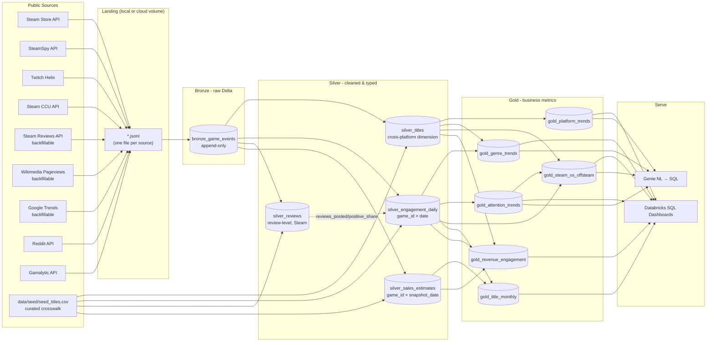

# Architecture

The Game Trend Lakehouse is a classic medallion pipeline: raw API responses land as immutable JSONL, are appended to a Bronze Delta table, cleaned and deduped into Silver, and aggregated into Gold tables that back dashboards and a Genie natural-language interface.

## Diagram

## Layer contracts

### Bronze — `bronze_game_events`

- **Purpose**: append-only landing of raw JSON payloads with provenance metadata.
- **Write pattern**: `df.write.format("delta").mode("append")`.
- **Schema (minimum)**:
  - `source` STRING — `"steam_store"` | `"steamspy"` | `"twitch_helix"` | `"steam_ccu"` | `"steam_reviews"` | `"wikipedia_pageviews"` | `"google_trends"` | `"reddit"` | `"steamspy_snapshot"` | `"gamalytic"`
  - `entity_key` STRING — source-native ID (appid, Twitch category, …); nullable for legacy rows
  - `extract_date` DATE — the date the payload *describes* (≠ `ingested_at` for backfills)
  - `ingested_at` TIMESTAMP
  - `payload` STRING (raw JSON; intentionally not exploded yet)
  - `batch_id` STRING (UUID per extraction run)
- **Why raw**: lets us re-derive Silver from history when upstream APIs evolve.

### Silver — `silver_titles`

- **Purpose**: the canonical **cross-platform title dimension** — one row per
  `game_id`, covering both Steam titles and off-Steam PC titles (Fortnite,
  League of Legends, …). See [`multi_platform_plan.md`](multi_platform_plan.md).
- **Key**: `game_id`, a stable slug from the seed crosswalk
  `data/seed/seed_titles.csv`; Steam titles outside the seed get a slugified
  name. `steam_appid` is **nullable** — NULL marks an off-Steam title, and the
  derived `on_steam` flag is the headline cohort split in Gold.
- **Crosswalk columns**: `twitch_category`, `wikipedia_article`, `subreddit`,
  `trends_term`, `storefronts` — how every other source joins to a title.
- **Write pattern**: `MERGE INTO ... ON game_id`; identity/crosswalk columns
  are seed-owned (batch wins), Steam-derived metadata coalesces so seed stubs
  never clobber previously ingested payload data.
- **Derived fields**: `release_year`, `is_free`, `supports_linux`, `supports_mac`, `supports_windows`, `primary_genre`, `genre_list`.
- **Quality rules**: drop rows missing `appid` or `name` at the Steam-parse
  stage; cast `price_cents` to INT; coalesce empty genre lists to `["unknown"]`.

### Silver — `silver_engagement_daily`

- **Purpose**: the wide cross-platform engagement fact table — one row per
  `game_id` × `date`, spanning Twitch viewership/channels, Steam CCU peak,
  and (as those sources land) Wikipedia pageviews, Google Trends, Reddit, and
  review velocity.
- **Column ownership**: each source's job fills only its own columns via
  `MERGE ON (game_id, date)` with per-column updates, so jobs are
  order-independent and never clobber each other. NULLs are meaningful:
  off-Steam titles never get Steam columns; days before a source's first
  poll or backfill stay NULL.
- **Snapshot semantics**: Twitch, CCU, Wikipedia, Trends, and Reddit are all
  rolled up by the single `build_engagement_daily` function; rollups
  recompute from full Bronze history for those sources, so re-runs are
  idempotent. `reviews_posted` / `reviews_positive_share` are the exception —
  they're written by the `silver_reviews` job (notebook `06`) via
  `reviews_daily_from_silver`, since review-level dedup by `review_id` has to
  happen before daily aggregation to avoid backfill pagination double-counts.

### Silver — `silver_reviews`

- **Purpose**: review-level detail for the Steam subset — one row per
  review. Kept separate from the daily engagement table because
  playtime-at-review cohorts can't be pre-aggregated away.
- **Write pattern**: dedupe/MERGE on `review_id` (bronze pagination can
  overlap across backfill re-runs); filtered to `review_ts >= HISTORY_START`
  (2020-01-01).
- **Feeds**: `reviews_daily_from_silver` rolls this up into the
  `reviews_posted` / `reviews_positive_share` columns of
  `silver_engagement_daily`.

### Silver — `silver_sales_estimates`

- **Purpose**: Steam-subset revenue/ownership estimates from SteamSpy
  (owner-tier ranges, no credentials) and Gamalytic (revenue/unit modeling,
  free-tier API key). All `est_`-prefixed — never presented as ground truth.
- **Grain**: `game_id` × `snapshot_date` × `est_source`. **Append-only** —
  every snapshot is kept, since the history of estimates is itself the time
  series Gold reads the latest value from.

### Gold — `gold_platform_trends`

Aggregate of `silver_titles` by `release_year` × platform:

| column          | type   |
| --------------- | ------ |
| release_year    | INT    |
| platform        | STRING |
| title_count     | BIGINT |
| free_pct        | DOUBLE |
| avg_price_cents | DOUBLE |

### Gold — `gold_genre_trends`

Aggregate of `silver_titles` by `release_year` × `primary_genre`:

| column        | type   |
| ------------- | ------ |
| release_year  | INT    |
| primary_genre | STRING |
| title_count   | BIGINT |
| release_share | DOUBLE |
| avg_price_cents | DOUBLE |

### Gold — `gold_attention_trends`

Grain: `game_id` × `week` (Monday date, string). Each raw signal is indexed
to that title's own **trailing 13-week baseline** (100 = its own recent
normal, computed from strictly prior weeks) so a niche indie title and
Fortnite are comparable on the same scale.

| column | type |
| --- | --- |
| game_id | STRING |
| week | STRING |
| twitch_idx, wiki_idx, trends_idx, reddit_idx | DOUBLE (nullable until 1 prior week of baseline exists) |
| attention_index | DOUBLE (mean of available idx columns) |
| attention_wow_delta | DOUBLE |
| twitch_avg_viewers, wiki_pageviews | raw values, for scale |

### Gold — `gold_steam_vs_offsteam`

Grain: `week` × `cohort` (`"on_steam"` \| `"off_steam"`) — the direct answer
to "how much PC gaming attention would a Steam-only catalog miss."

| column | type |
| --- | --- |
| week | STRING |
| cohort | STRING |
| title_count | BIGINT |
| twitch_viewer_share, wiki_pageview_share | DOUBLE |
| top20_attention_titles | BIGINT — count of this cohort's titles in that week's top-20 `attention_index` |

### Gold — `gold_title_monthly`

Grain: `game_id` × `month`. Leaderboard with rank and rank movement, ranked
by average Twitch viewers within the month.

| column | type |
| --- | --- |
| game_id | STRING |
| month | STRING |
| twitch_avg_viewers | DOUBLE |
| rank, rank_delta | INT (positive delta = moved up the leaderboard) |
| reviews_posted | BIGINT |
| est_revenue_snapshot | DOUBLE — latest `silver_sales_estimates` value at build time |

### Gold — `gold_revenue_engagement`

Grain: `game_id` × `month`, **Steam subset only**. All `est_` columns are
estimates (SteamSpy or Gamalytic), never ground truth.

| column | type |
| --- | --- |
| game_id | STRING |
| month | STRING |
| est_revenue_lifetime_usd, est_units_lifetime | DOUBLE / BIGINT |
| reviews_posted | BIGINT |
| twitch_avg_viewers | DOUBLE |
| revenue_per_avg_viewer | DOUBLE |

## Operational notes

- **Idempotency**: Bronze is append-only; `silver_titles` and
  `silver_engagement_daily` use MERGE on their natural keys with per-column
  coalescing so sources never clobber each other; `silver_reviews` dedupes on
  `review_id`; `silver_sales_estimates` is append-only by
  `(game_id, snapshot_date, est_source)`. All Gold tables are
  `CREATE OR REPLACE` (or `overwrite`) rebuilds from Silver — re-running the
  full pipeline is always safe.
- **Notebook order**: `01` (ingest) → `02` (titles) → `05` (engagement
  snapshots) → `06` (reviews & estimates) → `03` + `07` (all Gold tables).
  `05` and `06` are independent of each other and can run in either order —
  they own disjoint columns of `silver_engagement_daily`.
- **Partitioning**: at meaningful scale, partition Silver and Gold by `release_year` (low cardinality, naturally filtered in dashboards).
- **Catalog naming**: defaults to `main.game_trends.<table>`; override via notebook widgets.
- **Lakeflow / Asset Bundle**: `resources/databricks_asset_bundle.yml` shows the three original notebooks chained as tasks — extend it with `05`–`07` before deploying the full pipeline. Promote to a Lakeflow declarative pipeline by converting the notebooks to `@dlt.table` definitions.
- **Not yet implemented**: IGDB metadata enrichment (finer storefront/platform
  data for off-Steam titles beyond the seed CSV's manual `storefronts`
  column) and Steam global achievement percentages, both listed in
  [`multi_platform_plan.md`](multi_platform_plan.md) as secondary,
  metadata-polish sources — the seed crosswalk already covers what Gold needs
  today.
